# Harjoitus 7

## 'Oma moduli (iso tehtävä). Ratkaise jokin oikean elämän tai keksitty tarve omilla tiloilla/moduleilla'

Tähän tehtävään päätin ottaa osaksi **Linux palvelimet**-kurssilla luomani Minecraft-palvelinten ohjaus-scriptin **Minecontrol**. Tavoitteena olisi luoda useampi Ubuntu-virtuaalikone, joissa pyörisi Minecraft-palvelin.

Veisin herra-koneelta palvelinten tiedostot agentti-koneille, loisin **Minecontrol**-skriptiin tarvittavia muutoksia **grains**:n tietojen perusteella ja asentaisin tarvittavat ohjelmat/demonit agentti-koneille Minecraft-palvelimen pyörimiseksi.

Tämä verkko tulisi pyörimään omassa yksityisessä verkossa, sillä useamman minecraft palvelimen pyörittäminen vaatisi useampaa palvelinta, joissa olisi 2Gt muistia. Jo kolme tällaista konetta tulisi kustantamaan sen verra, että yhden kurssin loputehtävää varten en viitsi investoida.

## Koneet

Herra-kone:
* ThinkPad läppärini
  * OS: Ubuntu 18.04.4 LTS
  * CPU: Intel(R) Core(TM) i5-3210M CPU @ 2.50GHz
  * RAM: 8Gt

Agentti-koneet:
* VirtualBox kone
  * OS: Ubuntu live server 18.04.4 LTS _(linkaa ISOt)_
  * CPU: AMD Ryzen 5 2600 Six-Core Processor
  * RAM: 2Gt

## Aloitus

Aloitin luomalla ensiksi yhden testikoneen, jolla asettaisin palvelimen toiminta kuntoon käsin ennen automatisointia. Tiesin, että tulisin venkslaamaan edestakaisin herra- ja agentti-koneen välillä, joten loin SSH-avainparit koneiden välille komennoilla

	master $ ssh-keygen
	master $ ssh elmo@'testikoneen-IP'
	elmo@testikone $ exit
	master $ ssh-copy-id 'testikoneen-IP'

Seuraavaksi tarvitsin Minecraft-palvelimen _server.jar_-tiedoston. Latasin sen herra-koneelle Minecraftin [virallisilta sivuilta](https://www.minecraft.net/fi-fi/download/server/) _(kirjoitushetkellä versio 1.15.2)_. Loin tämän jälkeen herra-koneella tulevaa salt modulia varten kansion **saltmine/** sijaintiin **/srv/salt/**. En kuitenkaan tulisi vielä tekemään mitään tiedostoja tilan ajamiseksi, vaan siirsin lataamani _server.jar_:n sinne.

	master $ sudo cp /home/elmo/Downloads/server.jar ./server.jar

Seuraavaksi yhdistin agentti-koneelle **sftp**:llä, loin kansion **minecraft/** käyttäjän kotihakemistoon ja kopion herra-koneella olevan _server.jar_:in sinne.

	master $ sftp elmo@192.168.1.120
	sftp> mkddir minecraft
	sftp> cd minecraft/
	sftp> put server.jar

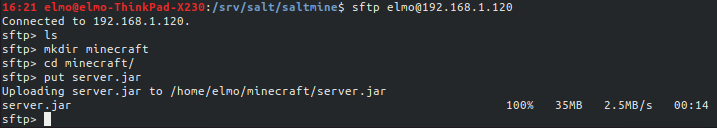

Seuraavaksi otin uudestaan yhteyden agentti-koneelle, siirryin kansioon **minecraft** ja yritin käynnistää _server.jar_:n. Käytin komentoa

	agent $ java -jar server.jar nogui

Tämä löytyy pidempänä samalta sivulta, josta latasin _server.jar_:n. Otin testien ajaksi pois muistin maksimi- ja minimimäärittelyt.

Sain kuitenkin virheilmoituksen, sillä koneelle ei ole asennettu javaa, jolla käynnistettäisiin palvelin. Virheilmoitus antaa kuitenkin pari vinkkiä etenemiseen.

_Virheilmoitus:_

	Command 'java' not found, but can be installed with:

	sudo apt install default-jre            
	sudo apt install openjdk-11-jre-headless
	sudo apt install openjdk-8-jre-headless 

Asensin openjdk-11 '_headless_':nä, tällöin kaikki graafiseen käyttöliittymään jää pois asennuspaketista, jos [Debian wikiä](https://wiki.debian.org/Java/) on uskominen.

	agent $ sudo apt install -y openjdk-11-jre

_Huomasin myöhemmin, että olin asentanutkin openjdk:n EI-headlessinä. Tällä ei käytännössä ole väliä palvelimen toiminnan kannalta, mutta EI-headless versio on isompi asennus. Jos tallennustila on kireällä, niin tämä voi olla kriittinen valinta._
Varmistin asennuksen onnistumisen ajamalla

	slave $ java -version

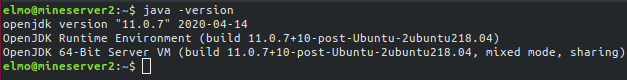

Seuraavaksi yritin käynnistää palvelimen _server.jar_, mutta sain virheilmoituksen; minun täytyy hyväksyä loppukäyttäjän lisenssisopimus. Käynnistyessään palvelin luo kansioon, jossa _server.jar_ sijaitsee useamman tiedoston ja kansion. Näiden joukossa on _eula.txt_, johon muutetaan siellä lukevan _eula=false_ arvoksi _eula=true_.

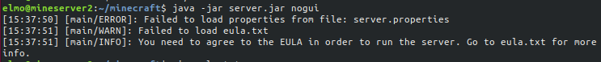

Kokeilin tämän jälkeen käynnistää palvelimen uudestaan komennolla

	slave $ java -jar server.jar nogui

Palvelin lähti pyörimään! Odotin, että palvelin ilmoittaa "Done". Nyt pystyisin kirjautumaan Minecraftissä omalle palvelimelleni, sillä palomuuri oli auki (sitä ei oltu edes asetettu). Pääsen pelissä palvelimelle antamalla pelkästään IP-osoitteen.

_Pelaajani palvelimella. Terminaalissa näkyy kirjautumiseni, sekä lähettämäni viesti_
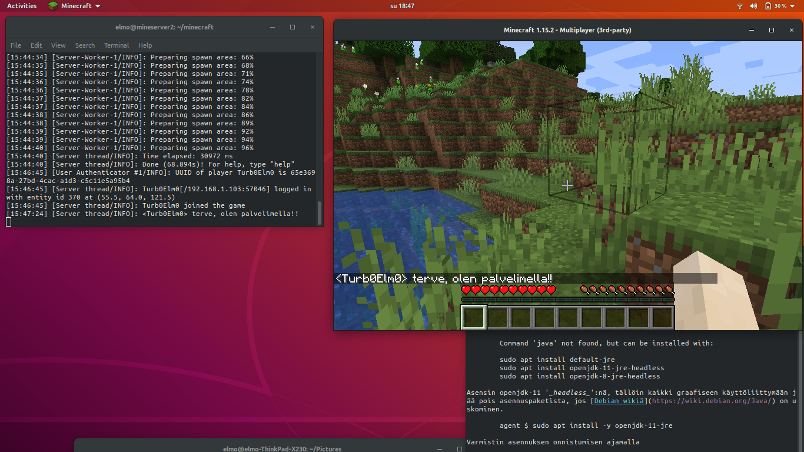

Seuraavaksi vein **sftp**:llä tekemäni minecontrol-skriptin _(linkkaa repo tähän myöhemmin)_. Vein skriptin tekemääni **minecraft/**-kansioon. Seuraavaksi otin yhteyden agentti-koneelle, menin **minecraft/**-kansioon ja ajoin komennon

	agent $ bash 2ndscript.sh start

_Tässä vaiheessa en ollut vielä nimennyt skriptiä 'minecontrol':ksi._

Sain ilmoituksen palvelimen onnistuneesta käynnistymisestä!

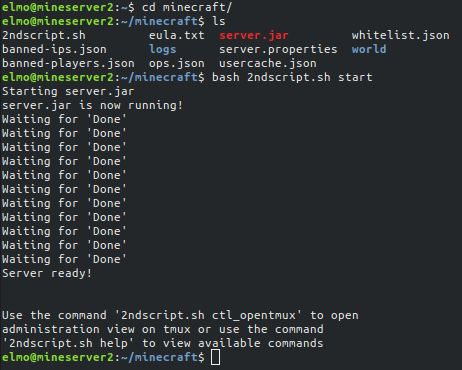

Seuraavaksi kokeilin kirjautua Minecraftissä palvelimelleni. Se onnistui! Avasin tmux-terminaalin, jossa _server.jar_ oli käynnissä tarkistaakseni, että olin tosiaan omalla palvelimellani.

	agent $ bash 2ndscript.sh opentmux

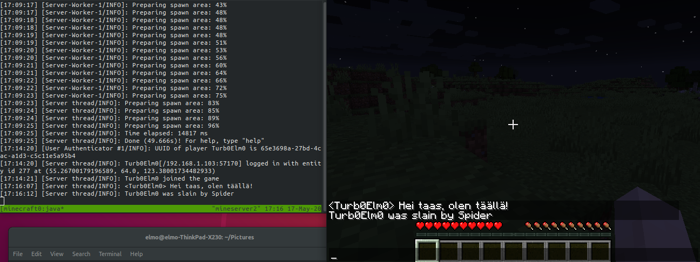

Tämän jälkeen sammutin palvelimen komennolla

	agent $ bash 2ndscript.sh stop

_server.jar sammui ja peli ilmoitti yhteyden katkenneen_
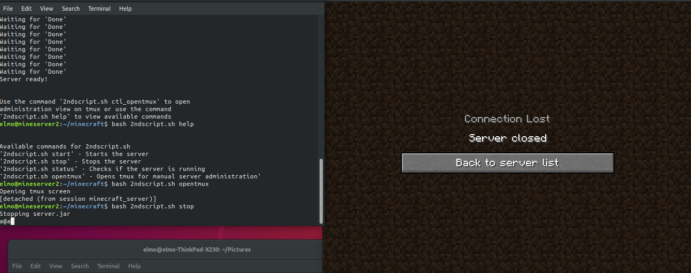

Olin näin saanut käsin asennuksen tehtyä! Seuraavaksi aloitin asennuksen, tiedostojen viennin yms. automanisoinnin.

Alustavasti tarvitsisin seuraavat:

* Vie server.jar herralta agentille kansioon **~/minecraft/**
* Luo samaan kansioon tiedosto _eula.txt_, joka sisältää '_eula=true_'
* Vie minecontrol-skripti joko samaan kansioon, tai kansioon **/usr/local/bin**
* Asenna openjdk-11-jre-headless
* Käynnistä server.jar saltin avulla

## Automatisoinnin aloitus

Loin automatisointia varten uuden agentti-koneen. Tein kuten alussa, eli automatisoin SSH-yhteyden ottamisen. Seuraavaksi asensin koneelle **salt-minion**:in komennolla

	agent $ sudo apt install -y salt-minion

Vaihdoin myös sudoeditorin **Vim**:ksi komennolla

	agent $ sudo update-alternatives --config editor

Vein koneen ID:n, sekä herrakoneen IP-osoitteen _minion_-tiedostoon seuraavilla komennoilla:

	agent $ echo "id: saltmine001" | sudo tee /etc/salt/minion
	agent $ echo "master: 192.168.1.103" | sudo tee -a /etc/salt/minion

ja käynnistin **salt-minion**:in uudestaan komennolla

	agent $ sudo systemctl restart salt-minion

Hyväksyin agentti-koneen herra-koneella komennolla

	master $ sudo salt-key -A

Ajoin myös klassisen 'whoami':n saltin kautta tarkistaakseni sen toimivuuden

	sudo salt 'saltmine001' cmd.run 'whoami'

Päätin tämän jälkeen ajaa koneelle aktiiviseksi aikaisemmassa harjoituksessa luomani salt-modulin **motdTemp**, sillä halusin eroon SSH-yhteydellä kirjautuessa joka kerta tulostuvan Ubuntun vakio-motd:n.

	master $ sudo salt 'saltmine001' state.apply motdTemp

Tila meni läpi onnistuneesti ja sain lyhyemmän motd:n kirjautuessani SSH:lla agentti-koneelle.

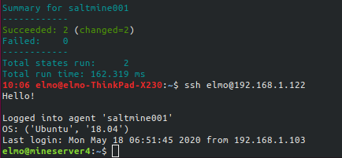

Loin tämän jälkeen **/srv/salt/saltmine/**-kansioon _init.sls_-tiedoston salt-modulin ajamista varten. Loin uuden kansion **minecraft/**, joka sisältäisi _server.jar_-tiedoston, joka vietäisiin agentti-koneen kotihakemistoon.

	master $ sudo mkdir minecraft
	master $ sudo mv server.jar ./minecraft/
	master $ sudo salt 'saltmine001' state.apply saltmine

_init.sls_:

	minecraft server.jar:
	  file.recurse:
	    - name: /home/elmo/minecraft
	    - source: salt://saltmine/minecraft

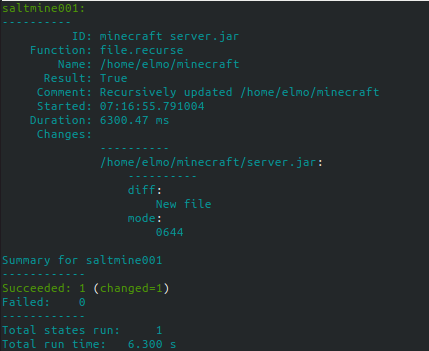

Tarkistin saltilla, että kyseinen kansio oli paikoillaan tiedostoineen:

	master $ sudo salt 'saltmine001' cmd.run ls /home/elmo/minecraft

Terminaaliin tulostui, että paikoillaan oli:

	saltmine001:
	    server.jar

Tarvitsin vielä **openjdk8**:n, sekä _eula.txt_-tiedoston, sisältönään 'eula=true', jotta voisin käynnistää _server.jar_:n. Loin **minecraft/**-kansioon nopeasti kyseisen tiedoston. Koska _eula.txt_ sijaitsee **minecraft/**-kansiossa _init.sls_ ei tarvitse muutoksia tiedoston viemiseksi, sillä koko kansio viedään tiedostoineen päivineen. Ajoin tilan uudestaan aktiiviseksi ja sain onnistumisesta ilmoituksen!

	master $ sudo salt 'saltmine001' state.apply saltmine

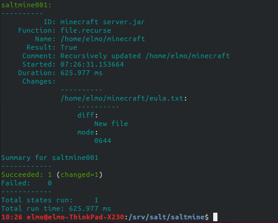

Lisäsin _init.sls_-tiedostoon pienen pätkän, jolla saisin **openjdk-11** asennettuna _headless_:nä. Ajoin tilan aktiiviseksi, joka onnistui ja testasin, oliko paketti onnistuneesti asennettuna.

_init.sls_

	minecraft server.jar:
	  file.recurse:
	    - name: /home/elmo/minecraft
	    - source: salt://saltmine/minecraft

	install openjdk:
	  pkg.installed:
	    - name: openjdk-11-jre-headless

_tilan ajoa:_

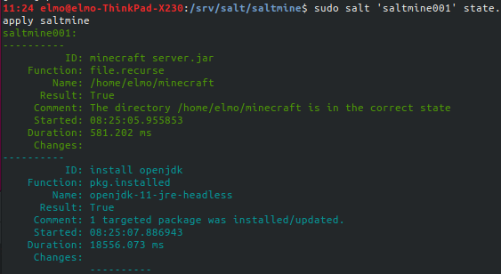

_saltin avulla javan asentumisen testaamista:_

	sudo salt 'saltmine001' cmd.run 'java -version'

_edellisen tuloste:_

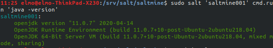

Tässä vaiheessa kaikki mitä Minecraft-palvelimen pyörittämiseen tarvitaan oli paikoillaan. Osasin kuitenkin odottaa ongelmia, sillä **salt**:lla tiedostoja, kansioita yms. viedessä, oikeudet ovat **root**:lla. Kirjaudumme agentti-koneelle aina käyttäjällä '**elmo**' ja näin ollen oletan ongelmia ilmenevän _server.jar_:ia ajettaessa.

Otin yhteyden agentti-koneelle SSH:lla, meni kotihakemistossa **minecraft/**-kansioon ja yritin käynnistää _server.jar_:n

	master $ ssh elmo@192.168.1.122
	agent $ cd minecraft/
	agent $ java -jar server.jar nogui

Virheilmoitusta tulostui aika mittavasti ja jo virheilmoituksen alkuosista voimme päätellä, että kyseessä voisi olla ongelma tiedoston/kansion oikeuksien suhteen:

_pätkää virheilmoituksen alusta:_

	2020-05-18 08:34:06,976 main ERROR Cannot access RandomAccessFile
	 java.io.IOException: Could not create directory
	 /home/elmo/minecraft/logs java.io.IOException:
	 Could not create directory /home/elmo/minecraft/logs

_virheilmoitusta tulee:_
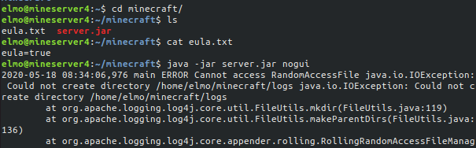

Ajoin seuraavaksi komennon

	agent $ ls -la

katsoakseni, millä oikeuksilla tiedostot ja kansiot olisivat. Epäilykseni **root**:n omistuksesta olivat oikeassa:

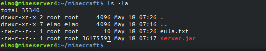

Seuraavaksi menin herra-koneelle ja tein muutamat muutokset _init.sls_-tiedostoon:

	minecraft directory:
	  file.directory:
	    - name: /home/elmo/minecraft
	    - user: elmo
	    - mode: 755

	minecraft server.jar:
	  file.managed:
	    - name: /home/elmo/minecraft/server.jar
	    - source: salt://saltmine/minecraft/server.jar
	    - user: elmo
	    - mode: 744
	    - require: 
	      - file: minecraft directory

	minecraft eula.txt:
	  file.managed:
	    - name: /home/elmo/minecraft/eula.txt
	    - source: salt://saltmine/minecraft/eula.txt
	    - user: elmo
	    - mode: 444
	    - require: 
	      - file: minecraft directory

	install openjdk:
	  pkg.installed:
	    - name: openjdk-11-jre-headless

Muutin kansion **minecraft/**-luomisen erilliseksi osaksi, ja loin _eula.txt_:lle ja _server.jar_:lle omat tilansa. Molemmat vaativat, että **minecraft/**-kansio on luotu. _eula.txt_:lle asetin oikeudet '444', sillä kenenkään ei tarvitse pystyä muuhun kuin tiedoston lukemiseen. _server.jar_:n oikeuksiksi asetin '744', eli testikäyttäjällämme on ajo-, luku- ja kirjoitusoikeudet, mutta muilla vain luku.

Tämän jälkeen ajoin tilan (useita kertoja, paljon pieniä kirjoitusvirheitä) lopulta onnistuneesti!

	master $ sudo salt 'saltmine001' state.apply saltmine

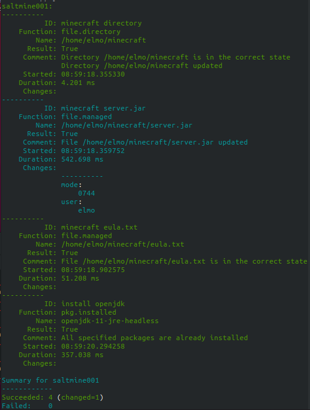

Otin yhteyden agentti-koneelle, ja käynnistin Minecraft-palvelimen onnistuneesti. Tämän jälkeen kirjauduin Minecraftissä palvelimelleni.

	agent $ cd minecraft/
	agent $ java -jar server.jar nogui

_palvelin ilmoittaa 'Done' ja päästää pelaamaan!_
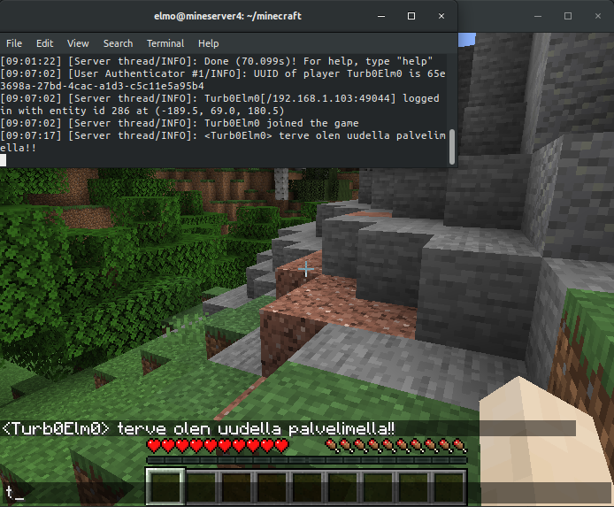

Oletin tästä, että oikeudet siis olivat menneet nappiin. Agentti-koneella ajoin kansiossa **minecraft/** komennon

	agent $ ls -la

katsoakseni oikeuksia ja nyt näyttää siltä miltä pitää!

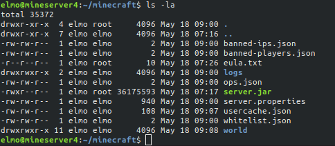

Seuraavaksi olisi luvassa käyttäjien luomista, minecontrol-skriptin asettelua ja editointia, sekä muottien käyttöä. Olen tähän asti kovakoodannut _init.sls_:ään käyttäjänimet, kansiosijainnit yms., mutta useampaa konetta ja käyttäjää hallittaessa tässä törmää nopeasti ongelmiin.

## Uusien käyttäjien luonti

Loin seuraavaksi uuden kansion **/srv/salt/usertest** käyttäjien luomista ja konffaamista varten saltilla. Loin _init.sls_-tiedoston, ja sinne seuraavat:

	minecraft:
	  user.present:
	    - home: /home/minecraft
	    - password: test
	    - hash_password: True

Tämän tilan luomista varten käytin apuna [SaltStackin dokumentaatiota](https://docs.saltstack.com/en/latest/ref/states/all/salt.states.user.html). _Init.sls_ luo nykyisessä muodossaan uuden käyttäjän 'minecraft', asettaa salasanaksi 'test', suolaa salasanan, ja asettaa kotihakemistoksi '**/home/minecraft**'. Ajoin tilan aktiiviseksi muutaman kerran (_kirjoitusvirheiden takia_), lopulta onnistuen. Kokeilin SSH-yhteyttä minecraft-käyttäjälle.

	master $ sudo salt 'saltmine001' state.apply usertest

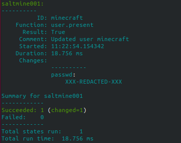

	master $ ssh minecraft@192.168.1.122

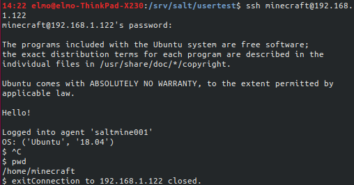

Tämä onnistui! Tein vielä pari muutosta _init.sls_-tiedostoon; lisäsin käyttäjän shelliksi bashin, sekä lisäsin käyttäjän ryhmään 'minecraft'.

_init.sls_

	minecraft:
	  user.present:
	    - home: /home/minecraft
	    - groups:
	      - minecraft
	    - password: test
	    - hash_password: True
	    - shell: /bin/bash

Päätin poistaa luomani 'elmo' käyttäjän agentti-koneelta. Otin tämän osaksi 'usertest'-tilaa. Käyttäisin luomaani 'minecraft'-käyttäjää ja tämän kotihakemistoa.

_init.sls_

	minecraft:
	  user.present:
	    - home: /home/minecraft
	    - groups:
	      - minecraft
	    - password: test
	    - hash_password: True
	    - shell: /bin/bash

	elmo:
	  user.absent:
	    - purge: True

Tila meni läpi onnistuneesti! En myöskään enää päässyt kirjautumaan käyttäjällä 'elmo'. _Huomasin jälkeenpäin, että olin unohtanut ottaa kuvakaappauksen tästä._

Seuraavaksi päätin kokeilla luoda listan käyttäjistä, jotka teoriassa tulisivat toimimaan palvelimella. Käytin muotteja generoidakseni käyttäjät. Lisäisin myös kaikki käyttäjät, jotka eivät ole nimeltään '**minecraft**' ryhmään '**user**'. Ajoin tilan aktiiviseksi, mutta sain virheilmoituksen; ryhmää '**user**' ei ollut olemassa.

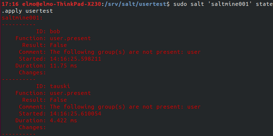

_init.sls_

	
	
	
	{{ user }}:
	  user.present:
	    - home: /home/minecraft
	    - groups:
	      
	      - user
	      
	      - minecraft
	    - password: test
	    - hash_password: True
	    - shell: /bin/bash
	
	elmo:
	  user.absent:
	    - purge: True

Luin [SalStackin dokumentaatiosta](https://docs.saltstack.com/en/latest/ref/states/all/salt.states.user.html), että **user.present**:n **groups** lisää siinä määriteltyihin ryhmiin vain jos ryhmät ovat olemassa. Tein pienen lisäyksen _init.sls_-tiedostoon, jossa loisin ryhmän '**user**' ja '**minecraft**' ja homma pelitti! (_minecraft-ryhmä oli jo luotuna minecraft-käyttäjän luonnin takia, mutta jos näin ei olisi, niin luotaisiin ryhmä 'minecraft'_)

_init.sls_

	

	user:
	  group.present

	minecraft group:
	  group.present:
	    - name: minecraft

	
	{{ user }}:
	  user.present:
	    - home: /home/minecraft
	    - groups:
	      
	      - user
	      
	      - minecraft
	    - password: test
	    - hash_password: True
	    - shell: /bin/bash
	

	elmo:
	  user.absent:
	    - purge: True

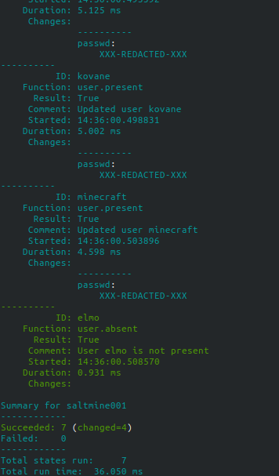

Kokeilin seuraavaksi kirjautua kaikilla luomilla käyttäjilläni SSH:n kautta, mikä onnistui! Kaikilla käyttäjillä oli sama salasana, niinkuin oli _init.sls_:ssä määritelty. Sain kuitenkin pitkähkön motd-tyyppisen vastauksen jokaisella käyttäjällä kirjautuessa.

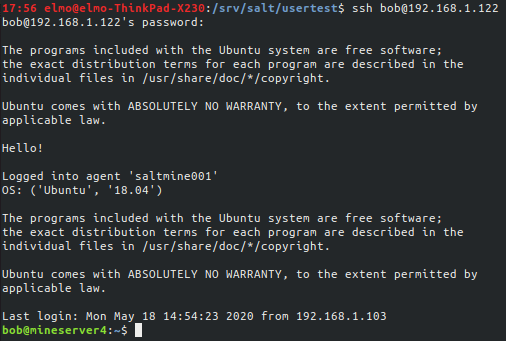

Lueskelin [tästä keskustelusta](https://askubuntu.com/questions/382931/how-to-remove-legal-notice-from-motd-banner-for-non-root-users), että helpoin ratkaisu olisi poistaa **/etc/legal**. Tätä kuitenkin yrittäessä tajusin, että palvelimella ei ollut enää yhtään sudo-oikeuksilla toimivaa käyttäjää.

Löysin pienen etsiskelyn jälkeen hyvän [Youtube videon](https://www.youtube.com/watch?v=YSSIm0g00m4), jossa kaiken muun lisäksi kerrottiin jokaisen '**admin**'-ryhmään kuuluvan käyttäjän omaavan **sudo**-oikeudet. Joudun tämän tekemään saltin kautta. sillä kellään yksittäisellä käyttäjällä agentti-koneella ei ole oikeuksia tehdä muutoksia.

Yritin lisätä käyttäjän '**minecraft**' ryhmään '**admin**', mutta sain ilmoituksen, että ryhmää ei ole olemassa. Luin [tästä artikkelista](https://askubuntu.com/questions/43317/what-is-the-difference-between-the-sudo-and-admin-group), että '**admin**'-ryhmä on jo vanhentunut ja nykyään käytetään ryhmää '**sudo** vastaaviin tarkoituksiin.

_epäonnistunut komento_

	master $ sudo salt 'saltmine001' cmd.run 'adduser minecraft admin'

_virheilmoitus_
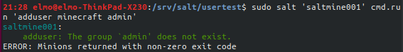

_onnistunut komento_

	master $ sudo salt 'saltmine001' cmd.run 'adduser minecraft sudo'

_onnistui!_
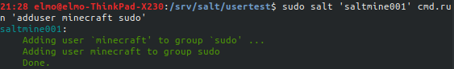

Seuraavaksi otin SSH-yhteyden agentti-koneelle ja poistin onnistuneesti **/etc/legal**:n. Kirjautuessa sain myös lupaavasti ilmoituksia sudo-oikeuksien käytöstä.

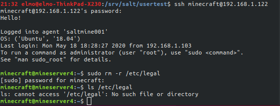

Näin sain myös kadotettua ikävän pitkän motd:in normaaleilta käyttäjiltä!

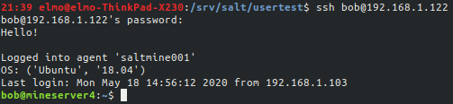

Aloitin näiden käsin tehtyjen muutosten tekemisen salt-tilalla.

Tein _init.sls_:ään seuraavat muutokset

	

	user group:
	  group.present:
	    - name: user

	minecraft group:
	  group.present:
	    - name: minecraft

	
	{{ user }}:
	  user.present:
	    
	    - home: /home/minecraft
	    - groups:
	      - minecraft
	      - sudo
	    - password: admin123
	    - hash_password: True
	    - shell: /bin/bash
	    
	    - home: /home/minecraft
	    - groups:
	      - minecraft
	      - user
	    - shell: /bin/bash
	    
	

Jos käyttäjän nimi on '**minecraft**', niin käyttäjä lisätään **sudo**-ryhmään. Muut menevät ryhmiin **minecraft** ja **user**.

Ajoin tilan aktiiviseksi onnistuneesti komennolla

	master $ sudo salt 'saltmine001' state.apply usertest

Seuraavaksi katsoin saltin kautta mihin ryhmiin käyttäjät kuuluivat.

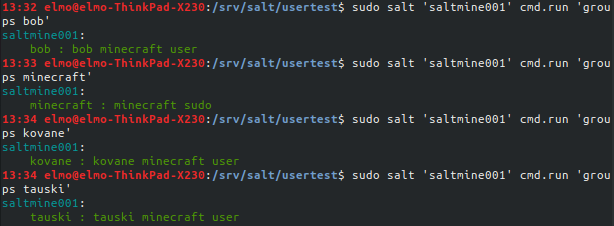

Tämä meni läpi! Seuraavaksi kokeilin salakirjoittaa salasanan 'test' käyttäjälle '**minecraft**' komennolla

	master $ openssl passwd -1

ja lisäsin saamani tulosteen _init.sls_:ssä siihen kohtaan, jossa määritellään käyttäjän salasana. Seuraavaksi ajoin tilan uudestaan aktiiviseksi, joka onnistui ja kirjauduin '**minecraft**'-käyttäjällä agentti-koneelle SSH:lla. Pääsin sisään kirjoittamalla salasanaksi 'test', jonka olin vienyt salakirjoitettuna! _Init.sls_:ssä tarvitsi myös ottaa '**minecraft**'-käyttäjän määrittelyistä pois 'hash-password: True'.

_init.sls:ssä muuttunut käyttäjän määrittely:_

	
	    - home: /home/minecraft
	    - groups:
	      - minecraft
	      - sudo
	    - password: $1$Xc08qFAA$gdTf/AzyPA5JGRRq/1H8k/
	    - shell: /bin/bash

## Pillareissa salaisuuksia (eli käyttäjät)

Lähdin seuraavaksi käyttämään saltin **pillareita** käyttäjien luontiin! Käytin ohjeina ja vinkkeinä [SaltStackin dokumentaatiota](https://docs.saltstack.com/en/latest/topics/tutorials/pillar.html), [erästä stackoverflow keskustelua](https://stackoverflow.com/questions/25077699/saltstack-create-user-password-is-not-set) aiheesta.

Loin uuden kansion /srv/**pillar/**, jonne loin myös tiedoston _top.sls_.

	master $ sudo mkdir /srv/pillar
	master $ cd /srv/pillar
	master $ sudoedit top.sls

_top.sls:_

	base:
	  'saltmine001':
	    - saltmine/addusers

Loin seuraavaksi kansion **saltmine/** ja loin sinne tiedoston _addusers.sls_.

_addusers.sls:_

	users:
	  minecraft:
	    groups:
	      - sudo
	      - minecraft

Seuraavaksi pyysin agentti-konetta päivittämään pillar-tietonsa, sekä pyysin konetta kertomaan kyseiset tiedot

	master $ sudo salt 'saltmine001' saltutil.refresh_pillar
	master $ sudo salt 'saltmine001' pillar.items

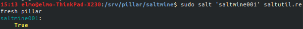

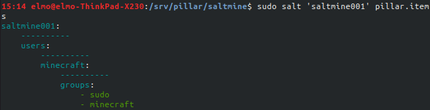

Tämän jälkeen tein kaikennäköisiä erinäisiä kikkailuja. Sain kuitenkin koneen sellaiseen tilaan, etten saanut siihen enää saltilla yhteyttä. Poistin käyttäjän '**minecraft**' ja vahingossa ylikirjoitin tiedoston **/etc/salt/minion**. Loin uuden agentti-koneen sen sijaan, että olisin säätänyt itselleni sudo-oikeudet jotenkin ja korjannut _minion_-tiedoston agenttikoneella.

_kikkailukomennot, ÄLÄ KÄYTÄ:_

	master $ sudo salt 'saltmine001' cmd.run 'userdel minecraft'
	master $ sudo salt 'saltmine001' cmd.run 'echo "" | tee /etc/salt/minion'

Unohdin laittaa edelliseen komentoon _echo_:lle, ja _tee_:stä parametrin **-a**, joten minion tiedosto tyhjeni.

Loin uuden agentti-koneen, jonka 'id' on **saltmine002**. Sain loppujen lopuksi pillarilla käyttäjien luomisen onnistumaan. Muutin _addusers.sls_-tiedoston nimeksi _init.sls_ ja vein sen kansioon **/srv/pillar/users**.

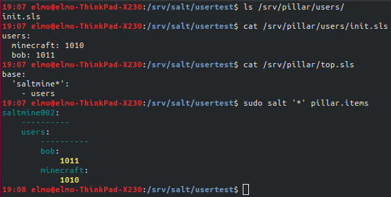

Lyhensin myös **usertest**-tilan _init.sls_-tiedostoa huomattavasti yrittäessäni saada tilan toimintakuntoon.

_init.sls_

	

	user group:
	  group.present:
	    - name: user

	
	{{ user }}:
	  user.present:
	    - uid: {{ uid }}
	

Ajoin tilan onnistuneesti!

	master $ sudo salt '*' state.apply usertest

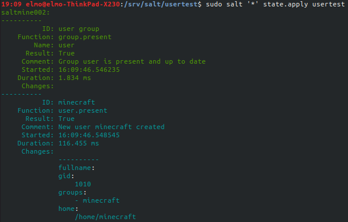

Tein seuraavaksi pari muutosta _init.sls_-tiedostoon **usertest**-tilassa, sekä _init.sls_-tiedostoon kansiossa **/srv/pillar/users/**.

_usertest-tilan init.sls_

	user group:
	  group.present:
	    - name: user

	
	{{ user }}:
	  user.present:
	    - uid: {{ details.get('uid', '') }}
	    - password: {{ details.get('password', '')}}
	

_init.sls-tiedosto, jossa käyttäjät_

	users:
	  minecraft: 
	    uid: 1010
	    password: test
	  bob:
	    uid: 1011
	    password: test

Ajoin tilan onnistuneesti aktiiviseksi, mutta en päässyt jostain syystä kirjautumaan käyttäjille.

Sain tilan lopulta toimimaan! Aikaisemmin linkkaamassani stackoverflow-keskustelussa kerrottiin, että homma toimii, jos salasanat salakirjoittaa **mkpasswd**:llä. Jouduin asentamaan sen ensiksi.

	master $ sudo apt install whois
	master $ mkpasswd -m sha-512
	
	Password: 
	$6$qpRQkZmu... jne..

Vein seuraavaksi ohjelman tulostaman salasanan **users**-pillarin _init.sls_-tiedostoon käyttäjän '**minecraft**' salasanaksi. Ajoin sen jälkeen onnistuneesti **usertest**-tilan ja pääsin kirjautumaan käyttäjällä agentti-koneelle!

	users:
	  minecraft: 
	    uid: 1010
	    password: $6$qpRQkZmuH... jne

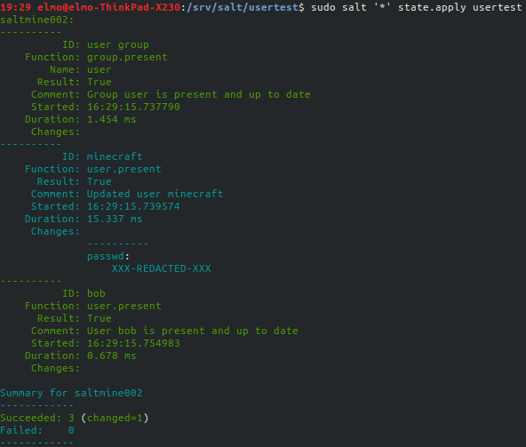

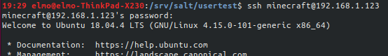

Tein seuraavaksi käyttäjille '**tauski**' ja '**minecraft**' määrittelyt loppuun. Salakirjoitin molempien salasanat ja annoin kummallekkin oikeat ryhmät. Tein tämän jälkeen tarvittavat muutokset _init.sls_-tiedostoon **usertest**-tilassa. Ajoin tämän jälkeen tilan onnistuneesti!

_init.sls usertest-tilalle:_

	minecraft group:
	  group.present:
	    - name: minecraft

	
	{{ user }}:
	  user.present:
	    - uid: {{ details.get('uid', '') }}
	    - password: {{ details.get('password','')}}
	    - hash_password: False
	    - home: /home/minecraft
	    
	    - groups:
	      
	      - {{ group }}
	      
	    
	    - shell: /bin/bash
	

_init.sls users-pillarissa:_

	users:
	  minecraft: 
	    password: $6$qpRQ.... jne
	    groups:
	      - sudo
	      - minecraft

	  tauski:
	    password: $6$EAuf8pBVI4.. jne
	    groups:
	      - minecraft

_tauskilla kirjautuminen_

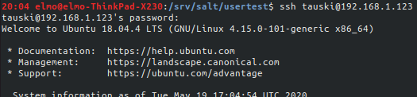

_minecraft-käyttäjän oikeuksien kokeilua_

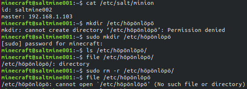

Näin olin konffannut alustavasti tarvitsevani käyttäjät!

## usertest-, motdTemp-, sekä saltmine-tilan yhdistäminen

Tein parit muutokset **saltmine**-tilan _init.sls_-tiedostoon. Kovakoodasin tiedostojen ja kansioiden omistajaksi käyttäjän '**minecraft**'. Olisin voinut käyttää pillareita, mutta aika rupesi loppumaan, enkä viitsinyt riskeerata mahdollisia aikataulun venymisiä. Ajoin tämän jälkeen tilan onnistuneesti!

_saltmine-tilan init.sls_

	minecraft directory:
	  file.directory:
	    - name: /home/minecraft/minecraft
	    - user: minecraft
	    - mode: 775

	minecraft server.jar:
	  file.managed:
	    - name: /home/minecraft/minecraft/server.jar
	    - source: salt://saltmine/minecraft/server.jar
	    - user: minecraft
	    - mode: 774
	    - require: 
	      - file: minecraft directory

	minecraft eula.txt:
	  file.managed:
	    - name: /home/minecraft/minecraft/eula.txt
	    - source: salt://saltmine/minecraft/eula.txt
	    - user: minecraft
	    - mode: 444
	    - require: 
	      - file: minecraft directory

	install openjdk:
	  pkg.installed:
	    - name: openjdk-11-jre-headless

	master $ sudo salt '*' state.apply saltmine

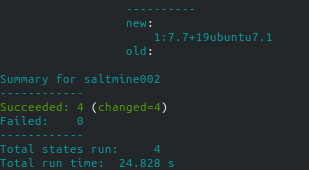

Tämän jälkeen minun pitäisi pystyä käynnistämään _server.jar_ molemmilla käyttäjillä '**tauski**' ja '**minecraft**'. Otin yhteyden agentti-koneelle käyttäjällä '**minecraft**', katsoin, että kansio **minecraft/** oli luotu ja siellä oli myös vaadittavat tiedostot. Seuraavaksi käynnistin _server.jar_:in onnistuneesti komennolla komennolla

	slave $ java -jar server.jar nogui

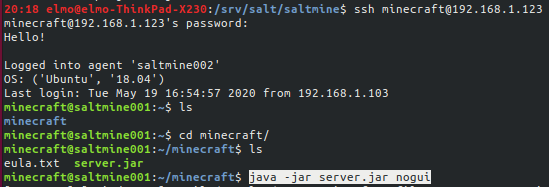

_Pääsin myös kirjautumaan palvelimelle Minecraftissä!_

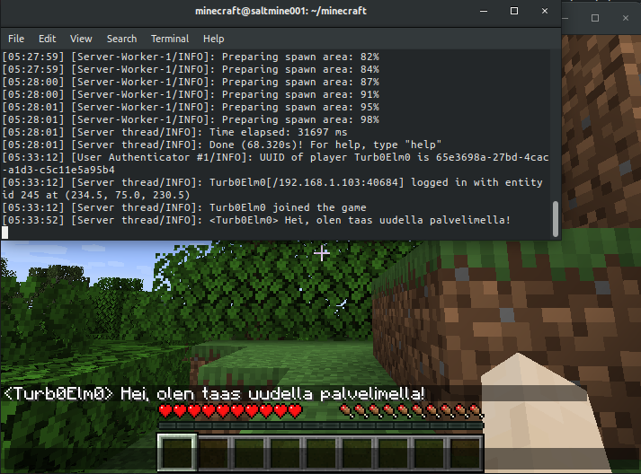

Kirjauduin ulos agentti-koneelta ja kirjauduin SSH:lla käyttäjällä '**tauski**' ja käynnistin palvelimen onnistuneesti! Pääsin myös kirjautumaan palvelimelle Minecraftissä.

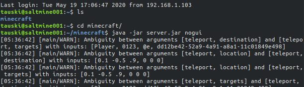

Huomasin samalla, että '**tauski**'lla kirjautuessa sain pitkän gneeroidun motd:in, jonka olin saanut aikaisemmin muilla käyttäjillä tässä tehtävässä. Ratkaisuna oli poistaa **/etc/legal**, joten lisäsin '_file.absent_'-kohdan tilaan **motdTemp** ja ajoin sen onnistuneesti!

_init.sls:ssä uusi 'delete user motd'_

	delete user motd:
	  file.absent:
	    - name: /etc/legal

	
	/etc/update-motd.d:
	  file.recurse:
	    - clean: True
	    - source: salt://motdTemp/update-motd.d
	

	/etc/motd:
	  file.managed:
	    - source: salt://motdTemp/motd
	    - template: jinja

_tilan ajo, testi kirjautumalla tauskilla_

