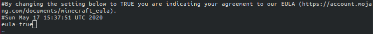
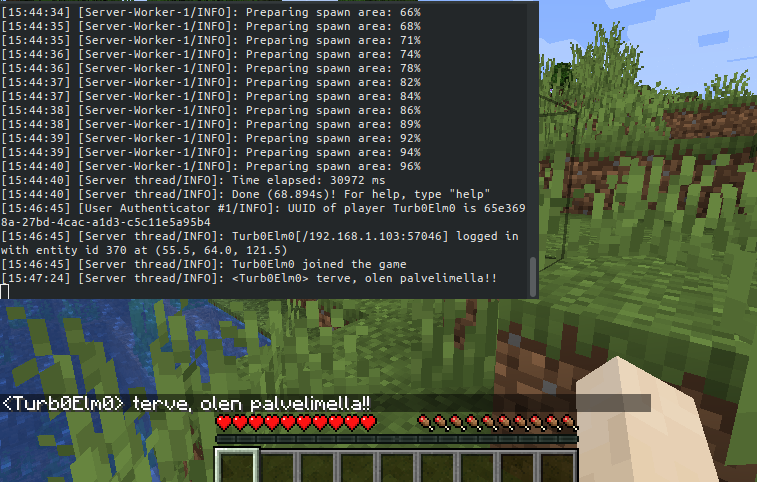

# Harjoitus 7

## 'Oma moduli (iso tehtävä). Ratkaise jokin oikean elämän tai keksitty tarve omilla tiloilla/moduleilla'

Tähän tehtävään päätin ottaa osaksi **Linux palvelimet**-kurssilla luomani Minecraft-palvelinten ohjaus-scriptin **Minecontrol**. Tavoitteena olisi luoda useampi Ubuntu-virtuaalikone, joissa pyörisi Minecraft-palvelin.

Veisin herra-koneelta palvelinten tiedostot agentti-koneille, loisin **Minecontrol**-skriptiin tarvittavia muutoksia **grains**:n tietojen perusteella ja asentaisin tarvittavat ohjelmat/demonit agentti-koneille Minecraft-palvelimen pyörimiseksi.

Tämä verkko tulisi pyörimään omassa yksityisessä verkossa, sillä useamman minecraft palvelimen pyörittäminen vaatisi useampaa palvelinta, joissa olisi 2Gt muistia. Jo kolme tällaista konetta tulisi kustantamaan sen verra, että yhden kurssin loputehtävää varten en viitsi investoida.

## Koneet

Herra-kone:
* ThinkPad läppärini
  * OS: Ubuntu 18.04.4 LTS
  * CPU: Intel(R) Core(TM) i5-3210M CPU @ 2.50GHz
  * RAM: 8Gt

Agentti-koneet:
* VirtualBox kone
  * OS: Ubuntu live server 18.04.4 LTS _(linkaa ISOt)_
  * CPU: AMD Ryzen 5 2600 Six-Core Processor
  * RAM: 2Gt

## Aloitus

Aloitin luomalla ensiksi yhden testikoneen, jolla asettaisin palvelimen toiminta kuntoon käsin ennen automatisointia. Tiesin, että tulisin venkslaamaan edestakaisin herra- ja agentti-koneen välillä, joten loin SSH-avainparit koneiden välille komennoilla

	master $ ssh-keygen
	master $ ssh elmo@'testikoneen-IP'
	elmo@testikone $ exit
	master $ ssh-copy-id 'testikoneen-IP'

Seuraavaksi tarvitsin Minecraft-palvelimen _server.jar_-tiedoston. Latasin sen herra-koneelle Minecraftin [virallisilta sivuilta](https://www.minecraft.net/fi-fi/download/server/) _(kirjoitushetkellä versio 1.15.2)_. Loin tämän jälkeen herra-koneella tulevaa salt modulia varten kansion **saltmine/** sijaintiin **/srv/salt/**. En kuitenkaan tulisi vielä tekemään mitään tiedostoja tilan ajamiseksi, vaan siirsin lataamani _server.jar_:n sinne.

	master $ sudo cp /home/elmo/Downloads/server.jar ./server.jar

Seuraavaksi yhdistin agentti-koneelle **sftp**:llä, loin kansion **minecraft/** käyttäjän kotihakemistoon ja kopion herra-koneella olevan _server.jar_:in sinne.

	master $ sftp elmo@192.168.1.120
	sftp> mkddir minecraft
	sftp> cd minecraft/
	sftp> put server.jar

Seuraavaksi otin uudestaan yhteyden agentti-koneelle, siirryin kansioon **minecraft** ja yritin käynnistää _server.jar_:n. Käytin komentoa

	agent $ java -jar server.jar nogui

Tämä löytyy pidempänä samalta sivulta, josta latasin _server.jar_:n. Otin testien ajaksi pois muistin maksimi- ja minimimäärittelyt.

Sain kuitenkin virheilmoituksen, sillä koneelle ei ole asennettu javaa, jolla käynnistettäisiin palvelin. Virheilmoitus antaa kuitenkin pari vinkkiä etenemiseen.

_Virheilmoitus:_

	Command 'java' not found, but can be installed with:

	sudo apt install default-jre            
	sudo apt install openjdk-11-jre-headless
	sudo apt install openjdk-8-jre-headless 

Asensin openjdk-11 '_headless_':nä, tällöin kaikki graafiseen käyttöliittymään jää pois asennuspaketista, jos [Debian wikiä](https://wiki.debian.org/Java/) on uskominen.

	agent $ sudo apt install -y openjdk-11-jre

_Huomasin myöhemmin, että olin asentanutkin openjdk:n EI-headlessinä. Tällä ei käytännössä ole väliä palvelimen toiminnan kannalta, mutta EI-headless versio on isompi asennus. Jos tallennustila on kireällä, niin tämä voi olla kriittinen valinta._
Varmistin asennuksen onnistumisen ajamalla

	slave $ java -version

Seuraavaksi yritin käynnistää palvelimen _server.jar_, mutta sain virheilmoituksen; minun täytyy hyväksyä loppukäyttäjän lisenssisopimus. Käynnistyessään palvelin luo kansioon, jossa _server.jar_ sijaitsee useamman tiedoston ja kansion. Näiden joukossa on _eula.txt_, johon muutetaan siellä lukevan _eula=false_ arvoksi _eula=true_.

Kokeilin tämän jälkeen käynnistää palvelimen uudestaan komennolla

	slave $ java -jar server.jar nogui

Palvelin lähti pyörimään! Odotin, että palvelin ilmoittaa "Done". Nyt pystyisin kirjautumaan Minecraftissä omalle palvelimelleni, sillä palomuuri oli auki (sitä ei oltu edes asetettu). Pääsen pelissä palvelimelle antamalla pelkästään IP-osoitteen.

_Pelaajani palvelimella. Terminaalissa näkyy kirjautumiseni, sekä lähettämäni viesti_

Seuraavaksi vein **sftp**:llä tekemäni minecontrol-skriptin _(linkkaa repo tähän myöhemmin)_. Vein skriptin tekemääni **minecraft/**-kansioon. Seuraavaksi otin yhteyden agentti-koneelle, menin **minecraft/**-kansioon ja ajoin komennon

	agent $ bash 2ndscript.sh start

_Tässä vaiheessa en ollut vielä nimennyt skriptiä 'minecontrol':ksi._

Sain ilmoituksen palvelimen onnistuneesta käynnistymisestä!

Seuraavaksi kokeilin kirjautua Minecraftissä palvelimelleni. Se onnistui! Avasin tmux-terminaalin, jossa _server.jar_ oli käynnissä tarkistaakseni, että olin tosiaan omalla palvelimellani.

	slave $ bash 2ndscript.sh opentmux

Tämän jälkeen sammutin palvelimen komennolla

	slave $ bash 2ndscript.sh stop

_server.jar sammui ja peli ilmoitti yhteyden katkenneen_

Olin näin saanut käsin asennuksen tehtyä! Seuraavaksi aloitin asennuksen, tiedostojen viennin yms. automanisoinnin.

Alustavasti tarvitsisin seuraavat:

* Vie server.jar herralta agentille kansioon **~/minecraft/**
* Luo samaan kansioon tiedosto _eula.txt_, joka sisältää '_eula=true_'
* Vie minecontrol-skripti joko samaan kansioon, tai kansioon **/usr/local/bin**
* Asenna openjdk-11-jre-headless
* Käynnistä server.jar saltin avulla

## Automatisoinnin aloitus
